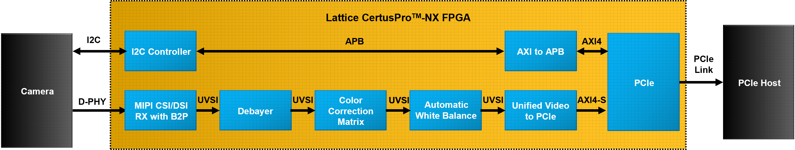

# MIPI CSI-2 to PCIe Reference Design

## Introduction
The CertusPro™-NX Mobile Industry Processor Interface (MIPI®) Camera Serial Interface-2 (CSI-2) to Peripheral Component Interconnect Express (PCIe®) reference design demonstrates the functionality of transferring MIPI CSI-2 sensor video data to a computer through PCIe with a direct memory access (DMA) engine. Built on the CertusPro-NX Versa Board, this design includes Linux® operating system (OS) driver support. This reference design showcases the complete data path—from capturing sensor data, transferring the data into the computer memory via PCIe and DMA, to rendering the video on the computer screen through the provided software driver.

## Features
Key features of the MIPI CSI-2 to PCIe reference design include:
- The Lattice MIPI CSI/DSI RX IP in this reference design is configured to support two or four lanes with lane rate of 1200 Mbps, as capped by IMX258 capability. The IP receives, processes, and converts incoming MIPI video payload packets up to 4K30 into Unified Video Streaming Interface (UVSI) packets. 
- The Lattice PCIe x4 IP provides DMA engine to perform data transfer between FPGA and host PC through PCIe Gen3x4 link. The IP is configured in DMA Bridge mode, providing an AXI4 interface that enables camera control from the host PC.
- The Lattice Debayer IP extracts the R, G, and B components from the pixel data output by the image sensor, converting the RAW10 data format into full RGB components. For details, refer to the \<Project_Directory>/latticesemi_custom_ip_debayer_1.4.0.03/doc/IP_Design_Notes.pdf.
- The Lattice Color Correction Matrix IP performs pixel data correction by adjusting R, G, and B components gain and compensates for color channel crosstalk. For details, refer to the \<Project_Directory>/latticesemi_custom_ip_ccm_1.3.1.03/doc/IP_Design_Notes.pdf.
- The Lattice Automatic White Balance IP automatically compensates for illumination temperature-based color differences in Bayer domain, such that white appears white. For details, refer to the \<Project_Directory>/latticesemi_custom_ip_awb_1.4.0.03/doc/IP_Design_Notes.pdf.
- The Unified Video to PCIe bridge maps UVSI packets to PCIe DMA Advanced eXtensible Interface-Stream (AXI-S) packets.

## Note
In some instances, the reference design may be updated without changes to the user guide. The user guide may reflect an earlier version but remains fully compatible with the later version.

## Block Diagram


## Getting started
Refer to [FPGA-RD-02338-1-1-CertusPro-NX-MIPI-CSI-2-to-PCIe-Reference-Design-User-Guide.pdf](docs/FPGA-RD-02338-1-1-CertusPro-NX-MIPI-CSI-2-to-PCIe-Reference-Design-User-Guide.pdf) for more information.

## Project and Executables
| Directory                                            | Description                                                  |
|:-----------------------------------------------------|:-------------------------------------------------------------|
| [mipi_csi_to_pcie.rdf](fpga_lfcpnx/radiant/mipi_csi_to_pcie.rdf)                           | Lattice Radiant project file for reference design            |
| [mipi_csi_to_pcie.sbx](fpga_lfcpnx/radiant/propelbld_mipi_csi_to_pcie/mipi_csi_to_pcie.sbx)  | Lattice Propel Builder project file for reference design     |
| [mipi_csi_to_pcie_impl_1.bit](fpga_lfcpnx/precompiled_file/mipi_csi_to_pcie_impl_1.bit)    | Precompiled bit file (IP Evaluation) to run reference design on the hardware |


## File Directory
```
<RD02338_mipi_csi_to_pcie>
├── docs                                (Documentation and Reference Design User Guide)
├── fpga_lfcpnx                         (Project files used in this design for device CPNX)
│   ├── precompiled_file                (Precompile bitstream for this design)
│   └── radiant                         (Radiant and Propel Buidler project materials for this design)
│       ├── propelbld_mipi_csi_to_pcie  (Propel Builder project materials for this design)
│       ├── sge
│       ├── src
│       │   └── constraints
│       └── verification
└── misc                                (Non-FPGA related files)
    ├── custom_ip                       (Lattice IP Packagers for custom IPs)
    └── software                        (Software Application and Driver)
        └── lsc_pcie_video_bridge
```

## Linux Environment
| Item   | Version            |
|--------|--------------------|
| OS     | Ubuntu 22.04.5 LTS |
| Kernel | 6.8.0-106-generic  |

## Known Issues
- This reference design uses MIPI CSI/DSI IP v4.0.0 instead of v4.2.0 because the v4.2.0 IP requires a 60 MHz reference clock, which is not available on the target development board (PCIe Vision Board). Users should not attempt to upgrade the MIPI IP to v4.2.0 until this limitation is addressed.

## Resources
[Lattice Semiconductor Support Center](https://www.latticesemi.com/support)